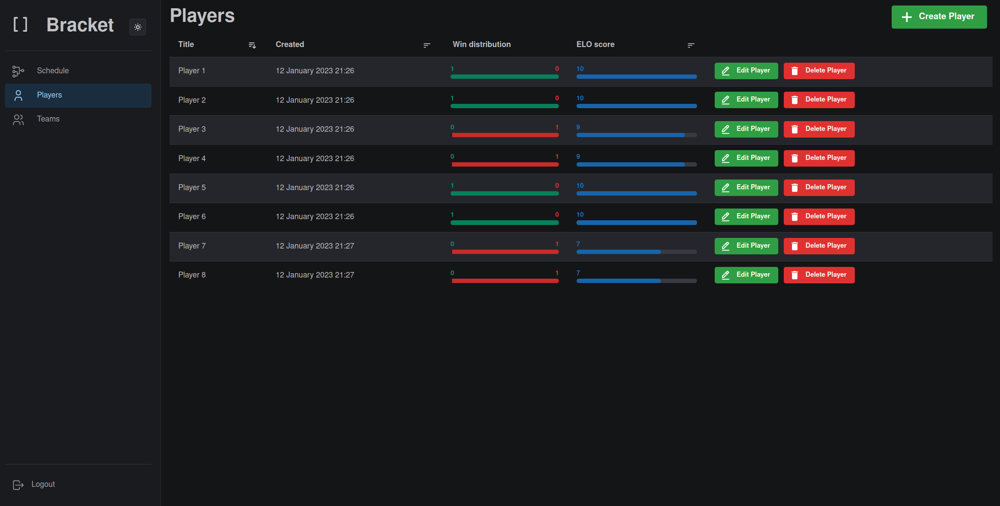

# Bracket
[](https://codecov.io/gh/evroon/bracket)
[](https://github.com/evroon/bracket/actions/workflows/backend.yml)
[](https://github.com/evroon/bracket/actions/workflows/frontend.yml)

Ladder tournament system meant to be easy to use.
it's written in async Python (with FastAPI) and Next.js as frontend.



# Setup
### Frontend
```
yarn
npm run dev
```

### Backend
```
./run.sh
```


#### Database
Create a new `bracket` database in a `bracket` cluster:

```shell
sudo pg_createcluster -u postgres -p 5532 13 bracket
pg_ctlcluster 13 bracket start

```

```shell
sudo -Hu postgres psql  -p 5532
CREATE USER bracket_ci WITH PASSWORD 'bracket_ci';
CREATE DATABASE bracket_ci OWNER bracket_ci;
```

```shell
sudo -Hu postgres psql  -p 5532
CREATE USER bracket_dev WITH PASSWORD 'bracket_dev';
CREATE DATABASE bracket_dev OWNER bracket_dev;
```

### Config
Put JWT_SECRET in prod.env using `openssl rand -hex 32`