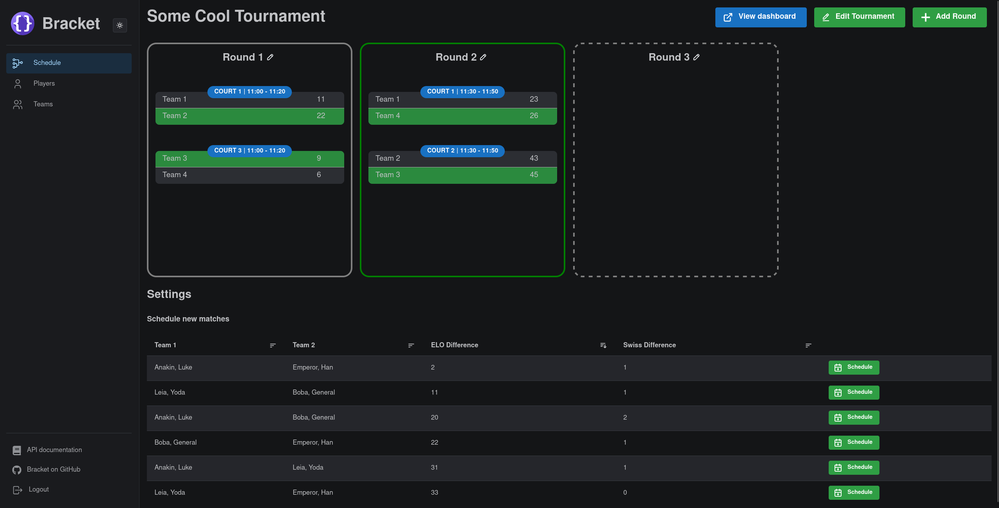
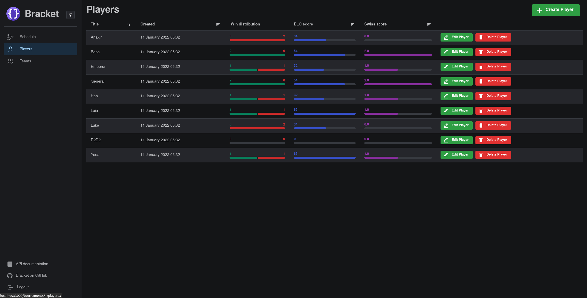

# Bracket
[](https://codecov.io/gh/evroon/bracket)
[](https://github.com/evroon/bracket/actions/workflows/backend.yml)
[](https://github.com/evroon/bracket/actions/workflows/frontend.yml)
[](https://img.shields.io/github/last-commit/evroon/bracket)
[](https://img.shields.io/github/v/release/evroon/bracket)

<br/>

Ladder tournament system meant to be easy to use.
Bracket is written in async Python (with FastAPI) and Next.js as frontend using the [Mantine](https://mantine.dev/) library.


### Preview



# Setup


## Database
First create a `bracket` cluster:
```shell
sudo pg_createcluster -u postgres -p 5532 13 bracket
pg_ctlcluster 13 bracket start
```

Subsequently, create a new `bracket_dev` database:
```shell
sudo -Hu postgres psql  -p 5532
CREATE USER bracket_dev WITH PASSWORD 'bracket_dev';
CREATE DATABASE bracket_dev OWNER bracket_dev;
```

You can do the same but replace the user and database name with:
- `bracket_ci`: for running tests
- `bracket_prod`: for a production database

The database URL can be specified per environment in the `.env` files (see [config](#config)).

## Config
Copy [ci.env](backend/ci.env) to `prod.env` and fill in the values:
- `PG_DSN`: The URL of the PostgreSQL database
- `JWT_SECRET`: Create a random secret using `openssl rand -hex 32`
- `CORS_ORIGINS` and `CORS_ORIGIN_REGEX`: Specify allowed frontend domain names for CORS (see the [FastAPI docs](https://fastapi.tiangolo.com/tutorial/cors/))
- `ADMIN_EMAIL` and `ADMIN_PASSWORD`: The credentials of the admin user, which is created when initializing the database


## Running the frontend and backend
The following starts the frontend and backend for local development:
### Frontend
```
cd frontend
yarn
npm run dev
```

### Backend
```
cd backend
pipenv install -d
pipenv shell
./run.sh
```
