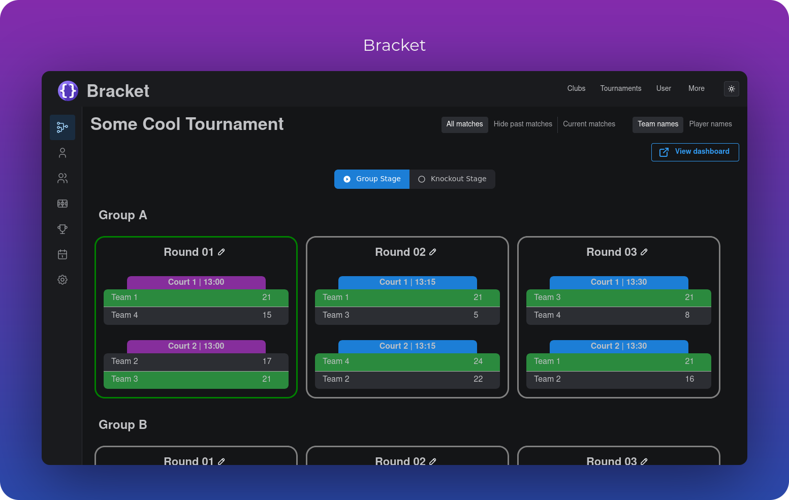
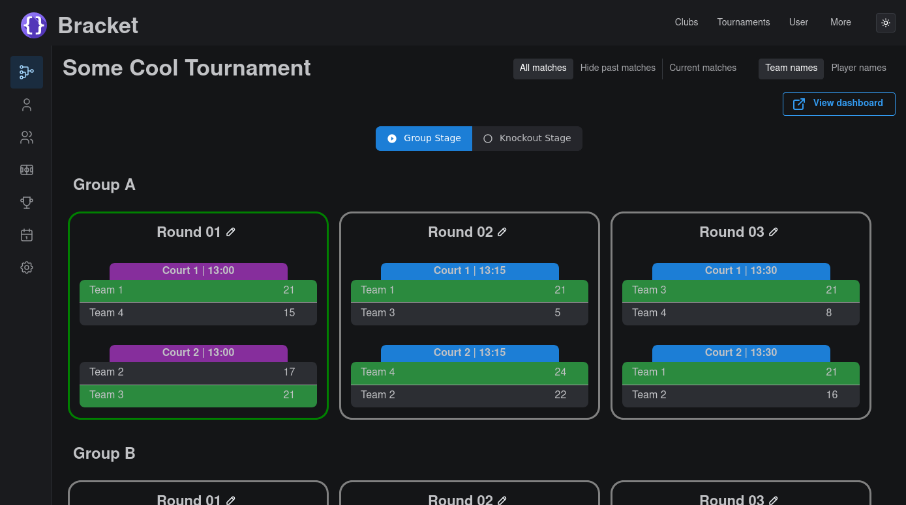
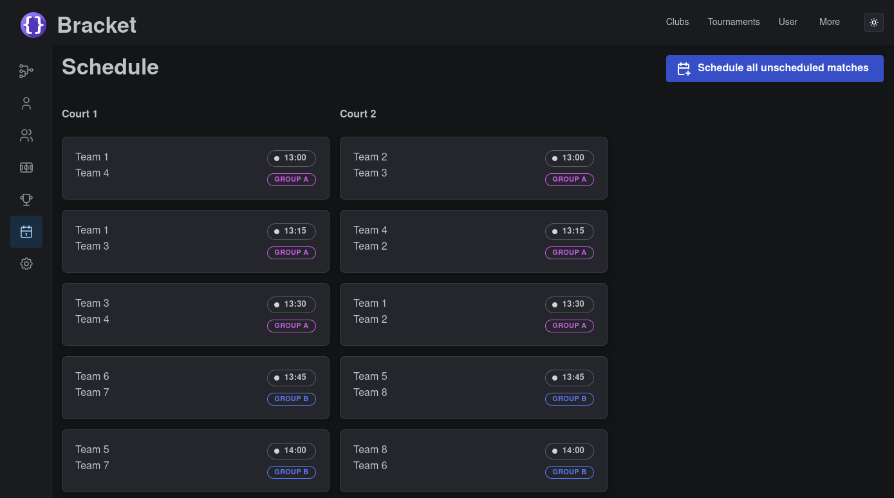
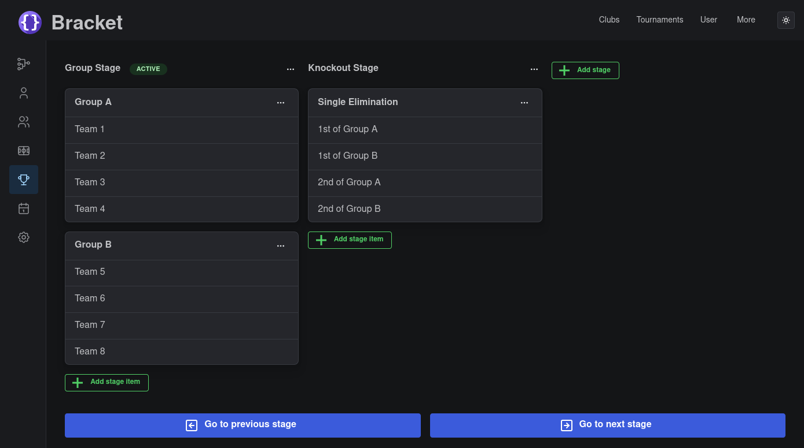
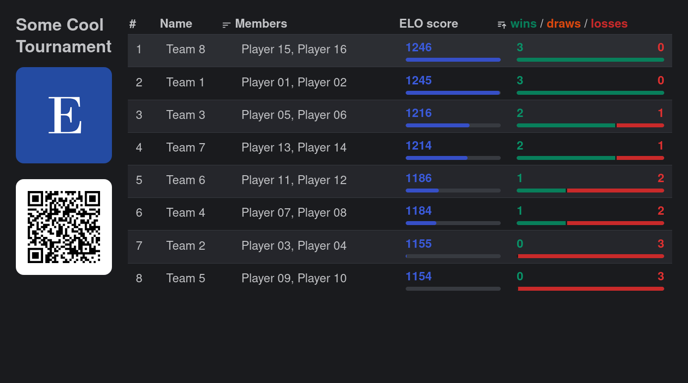

# Bracket
[](https://codecov.io/gh/evroon/bracket)
[](https://github.com/evroon/bracket/actions/workflows/backend.yml)
[](https://github.com/evroon/bracket/actions/workflows/frontend.yml)
[](https://img.shields.io/github/last-commit/evroon/bracket)
[](https://img.shields.io/github/v/release/evroon/bracket)

<br/>

Tournament system meant to be easy to use. Bracket is written in async Python (with
[FastAPI](https://fastapi.tiangolo.com)) and [Next.js](https://nextjs.org/) as frontend using the
[Mantine](https://mantine.dev/) library.

It has the following features:
- Supports **single elimination, round-robin and swiss** formats.
- **Build your tournament structure** with multiple stages that can have multiple groups/brackets in
  them.
- **Drag-and-drop matches** to different courts or reschedule them to another start time.
- Various **dashboard pages** are available that can be presented to the public, customized with a
  logo.
- Create/update **teams**, and add players to **teams**.
- Create **multiple clubs**, with **multiple tournaments** per club.
- **Swiss tournaments** can be handled dynamically, with automatic scheduling of matches.

### Preview



# Quickstart
To quickly run bracket to see how it works, clone it and run `docker-compose up`:
```bash
git clone git@github.com:evroon/bracket.git
cd bracket
sudo docker-compose up -d
```

This will start the backend and frontend of Bracket, as well as a postgres instance. You should now
be able to view bracket at http://localhost:3000. You can log in with the following credentials:

- Username: `test@example.org`
- Password: `aeGhoe1ahng2Aezai0Dei6Aih6dieHoo`.

To insert dummy rows into the database, run:
```bash
sudo docker exec bracket-backend pipenv run ./cli.py create-dev-db
```

See also the [quickstart docs](http://localhost:3000/bracket/docs/running-bracket/quickstart).

# Development setup
Read the [development docs](https://evroon.github.io/bracket/docs/running-bracket/development) for how to run Bracket for development.

Prerequisites are `yarn`, `postgresql` and `pipenv` to run the frontend, database and backend.

# Configuration
Read the [configuration](https://evroon.github.io/bracket/docs/running-bracket/configuration) for how to configure Bracket.

Bracket's backend is configured using `.env` files (`prod.env` for production, `dev.env` for development etc.).
But you can also configure Bracket using environment variables directly, for example by specifying them in the `docker-compose.yml`.

The frontend doesn't can be configured by environment variables as well, as well as `.env` files using Next.js' way of loading environment variables.

# Running Bracket in production
Read the [deployment](https://evroon.github.io/bracket/docs/running-bracket/deployment) for how to deploy Bracket and run it in production.

Bracket can be run in Docker or by itself (using `pipenv` and `yarn`).

# Translations
Based on your browser settings, your language should be automatically detected and loaded. For now,
there's no manual way of choosing a different language.

## Supported Languages

- 🇺🇸 English `en-US` - *Default*
- 🇨🇳 Chinese `zh-CN` - Contributed by @Sevichecc

# More screenshots
 

# Help
If you're having trouble getting Bracket up and running, or have a question about usage or configuration, feel free to ask.
The best place to do this is by creating a [Discussion](https://github.com/evroon/bracket/discussions).

# Supporting Bracket
If you're using Bracket and would like to help support its development, that would be greatly appreciated!

Several areas that we need a bit of help with at the moment are:
- ⭐ **Star Bracket** on GitHub
- 🌐 **Translating**: Help make Bracket available to non-native English speakers by adding your language
- 📣 **Spread the word** by sharing Bracket to help new users discover it
- 🖥️ **Submit a PR** to add a new feature, fix a bug, extend/update the docs or something else

# License
Bracket is licensed under AGPL-v3.0
See [LICENSE](LICENSE)
